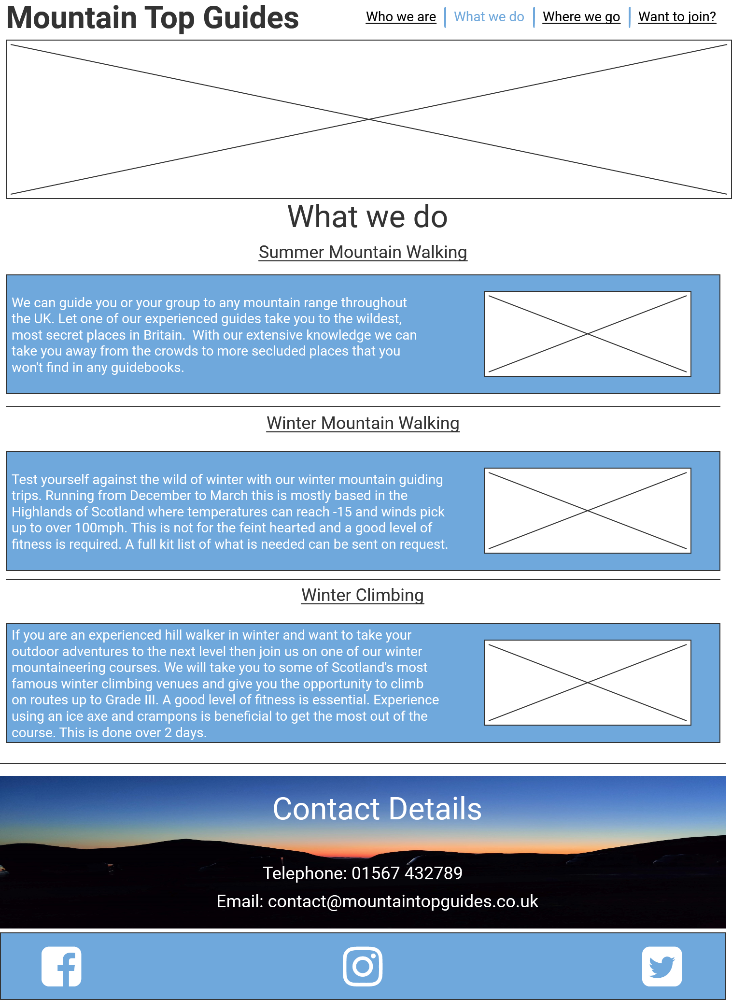

# Mountain Top Guides
This website is targeted towards people who want to adventure into the mountains of the UK during summer and winter but maybe don't have the confidence or skillset to do it in a safe and responsible manner.
It is aimed at the beginner and more advanced hill walker. It also offers customers the opportunity to try winter climbing. The site will be useful for walkers to realise they don't need to have knowledge in mountain saftey to enjoy the wilder parts of Britain, as the guide will keep them safe at all times.

[Link to live website](https://scotrob77.github.io/mountain-top-guides/index.html)

# Features
## Existing Features
### Company logo
* Featured on every page the logo also has a link to the home page.
### Navigation Bar
* Featured on all 4 pages the navigation bar is resonsive and highlights which page the user is on by being underlined.
* Each section shows a different colour line under it when hovered over.

### Hero image
* The hero image is used on the home page. It is an eye catching image and gives the user an instant idea of what Mountain Top Guides offer.

### Who we are section
* This section shows the user who works for Mountain Top Guides by using photos of the two guides and text explaining their experience.
* It is useful as it shows the user who the people are who they would be hiring. Happy, smiling photos are used to show the user that the guides are friendly and approachable.
* Photos are taken in an outdoor setting to re-emphasise the purpose of the company.

### Contact details
* This section is used across 3 of the 4 pages, but not the Want to join page as there is other ways of contacting on that page.
* This section gives an aesthetic image of a sunset in the hills to capture the eye of the user.
* It also shows the user the name of the company, a phone number and email address enabling them to contact via this media if preferred.

### Footer
* This section which is on all pages gives links to social media pages, Facebook, Instagram and Youtube. They will open on a seperate page. 
* This will be useful to the user so they can see pictures and videos of past trips and also encourages the user to keep connected.

### What we do page
* This page has 3 sections ordered vertically and will show what Mountain Top Guides has to offer. An alluring image has been set aside the text of what they offer to allow the user an idea of what they could experience for each trip.

### Where we go page
* This page will provide the user with thumbnail images showing the scenery seen on previous trips and what the user could expect to see if they were to venture out with Mountain Top Guides. By clicking on the thumbnails a larger picture will open up in a new page.

### Want to join page
* This page will give the user the opportunity to find out more and to ask specific questions
* The user will be unable to submit unless all fields have been completed.
* This is a fake form and will send you to a Thank You page.

* There is also a map on the Want to join page giving a fictitious address. Clicking on the map will open up the map in a new page on Google Maps

### Future features
* A blog offering advice and tips for the hill walking community.
* A page for customers to upload their own pictures taken on trips with Mountain Top Guides.

# Typography and color scheme
* I want fonts that are clear and easy to read so used Roboto for headings and Nunito for main text from [Google Fonts](https://www.Fonts.google.com)
* I wanted a clear, clean color scheme so opted for blue background with a white text. 

# Wireframes

# Testing
* I tested that this page works on Chrome and Edge.
* I confirmed that this project is responsive and works on all screen sizes using the dev tools available on Chrome and Edge.
* I confirmed that all text is readable and easy to understand.
* I confirmed that all internal links work as they should.
* I have confirmed that the Want to join form works: that it requires an entry in each field; will only accept a proper email format in the email field; and the submit button takes you to a thank you page.

# Bugs
### Solved Bugs
* When I deployed to Github pages and validated there were errors in my nav list. There were two closing li tags. This was resolved by deleting one.
* The background colour also didn't contrast well enough with some of the text. I changed the background colour to a darker blue and removed the dark blue text for white.

### Unresolved Bugs
* On smaller screens (under 430px) the nav bar goes onto two lines with the first two pages going onto the second line which would be better if they were on the top line. The links still work but is not aeshetically the best

# Validator Testing
### HTML
* No errors were returned when passing through the official W3C validator
### CSS
* No errors were found when passing through the official (Jigsaw) validator
### Accessibility
* I confirmed that the colours and fonts chosen are easy to read and accessible by running it through lighthouse in devtools

# Deployment
* The site was deployed to Github pages. The steps to deploy are as follows:
<ol>
     <li> In the Github repository, navigate to the Settings tab
     </li>
     <li> Scroll down to the Github Pages section and click on 'Check it out here!'
     </li>
     <li> From the source section drop-down menu, select the Main Branch and click save
     </li>
     <li> Once the Main Branch has been selected and saved the page provided the link to the completed website
     </li>
    
</ol>

The live link can be found here [Mountain Top Guides](https://scotrob77.github.io/mountain-top-guides/index.html)

# Credits
### Content
* The code for sign up form on the Want to join page was based on the code from Code Institutes Love Running Walkthrough Project. The colour scheme, text, and box count was altered from the original code.
* The icons in the footer and logo in header were taken from [Font Awesome](https://FontAwesome.com)
* The code for the border around the Who we are and What we do sections was taken from [Code Pen](https://codepen.io)

### Media
* The Home Image on the home page was taken from [iStockPhoto](https://istockphoto.com)
* The Summer hill walking image on the What we do page was taken from [Pixabay](https://pixabay.com)
* The winter climbing image was taken from [RawPixel](https://rawpixel.com)
* The last image on the Where we go page was taken from [Pixabay](https://pixabay.com)
* All other images are authors own

